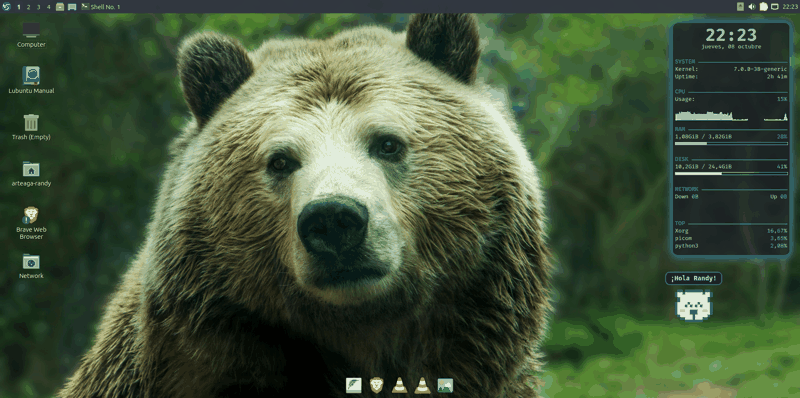

# ʕ•ᴥ•ʔ Bear Pet

A tiny pixel-art bear that wanders around your Linux desktop, makes faces, and drops friendly messages in a speech bubble.



## Features

- **Walks around** the desktop with a little hop, then stops to say something.
- **12 expressions**: normal, blink, happy, love, surprised, wink, dizzy, sad, cool, angry, silly and sleepy.
- **Mood-based messages**: each face has its own lines (messages are in Spanish).
- **Goes to sleep** between 23:00 and 06:00.
- **Stays out of your way**: it lives on the desktop layer, below your windows, and mouse clicks pass straight through it.
- **Lightweight**: a single Python file that only repaints the area around the bear.

## Requirements

- Linux with an **X11** session (tested on Lubuntu 26.04 LTS with LXQt + Openbox).
- A **compositor** such as `picom` for the transparent background.
- `python3-pyqt6` and `wmctrl` (the installer adds both).

Wayland sessions are not supported yet.

> **Note:** "Show desktop" (`Super+D`) also hides the bear. Run `python3 ~/.local/bin/bear_pet.py &` to bring it back.

## Install

```bash
git clone https://github.com/SteimberAZ/bear-pet.git
cd bear-pet
./install.sh
```

The installer copies `bear_pet.py` to `~/.local/bin/` and adds an autostart entry, so the bear shows up on every login.

To run it once without installing:

```bash
python3 bear_pet.py
```

## Uninstall

```bash
./uninstall.sh
```

## Customize

Everything lives in `bear_pet.py`:

| What | Where |
|---|---|
| Add or edit messages | `MSGS` dictionary (one list per face) |
| Draw a new face | `FACES` dictionary: override rows 5–11 of the 15×13 grid |
| Colors | `COLORS` (`X` outline, `.` fill, `P` pink, `B` blue) |
| Bear size | `self.px` (pixel size, default `6`) |
| Walking speed | `step = min(d, 2.2)` in `tick()` |

Grid legend: `X` outline, `.` fill (or empty when outside the bear), `P` pink, `B` blue.

### Using picom?

Exclude the pet from shadows, focus dimming and rounded corners so it blends in:

```
shadow-exclude = [ "name = 'BearPet'" ];
focus-exclude = [ "name = 'BearPet'" ];
rounded-corners-exclude = [ "name = 'BearPet'" ];
```

## License

[MIT](LICENSE)
